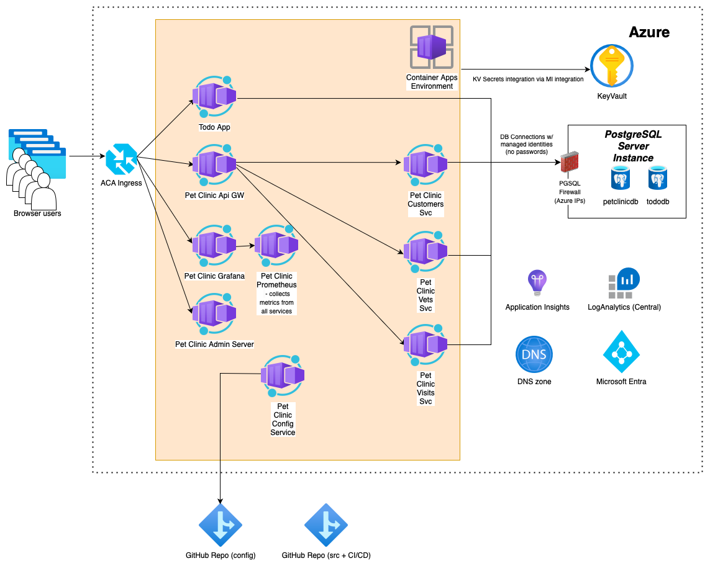

# Broken, under development

# Distributed version of the Spring PetClinic Sample Application built with Spring Cloud 

Clone of the  spring-petclinic-microservices GitHub Repo: [https://github.com/spring-petclinic/spring-petclinic-microservices](https://github.com/spring-petclinic/spring-petclinic-microservices), used to demonstrate deploying a distributed Spring Boot App into Azure Container Apps (ACA), while usilising other services as managed PostgreSQL database, Application Insights, Azure Key Vaults etc..

Application architecture and the original description of this Spring Boot app can be found [here](./README_orig.md).

## Different ways of deploying the app into Azure Container Apps (ACA)

* [Deploying apps using Command Line Interface (AZ CLI) and Bicep templates](./docs/aca-bicep.md)
* [Deploying the app using GitHub Actions (CI/CD pipelines)](./docs/aca-github-actions.md)