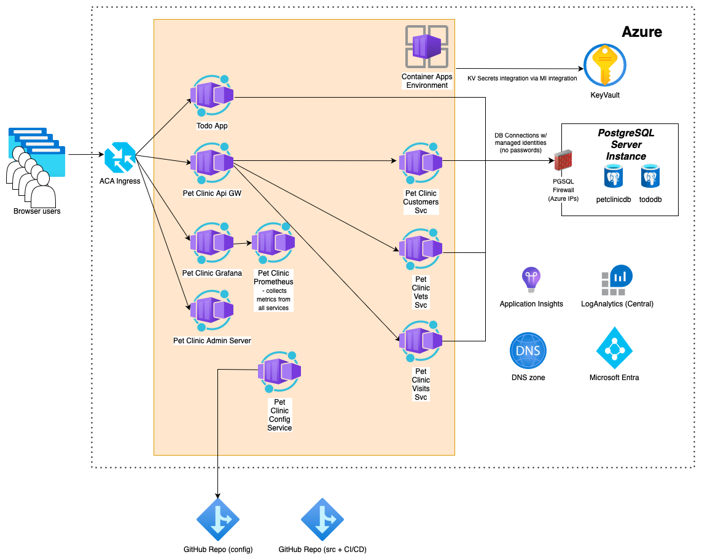

# Spring Boot Todo App and Pet Clinic App on Azure Container Apps (ACA)

## Deploying Todo App and Pet Clinic App into an ACA using az CLI and Azure Bicep templates



* Start the command line, clone the repo using ```git clone https://github.com/martinabrle/aca-java-demo.git``` and change your current directory to ```aca-java-demo/scripts``` directory:

    ```bash
    cd ./aca-java-demo/scripts
    ```

* Log in into Azure from the command line using ```az login``` ([link](https://docs.microsoft.com/en-us/cli/azure/authenticate-azure-cli))
* List available Azure subscriptions using ```az account list -o table``` ([link](https://docs.microsoft.com/en-us/cli/azure/account#az-account-list))
* Select an Azure subscription to deploy the infra into, using ```az account set -s 00000000-0000-0000-0000-000000000000```
  ([link](https://docs.microsoft.com/en-us/cli/azure/account#az-account-set)); replace ```00000000-0000-0000-0000-000000000000``` with Azure subscription Id you will deploy into
* Set environment variables:

    ```bash
    AZURE_LOCATION="switzerlandnorth" # <--azure region for deploying resources
    ACA_NAME="aca-java-demo"
    ACA_RESOURCE_GROUP="aca_java_demo_rg"
    PGSQL_NAME="{{{REPLACE_WITH_PGSQL_NAME}}}" # <--PGSQL Server name, needs to be unique
    CONTAINER_REGISTRY_NAME="{{{REPLACE_WITH_APP_SERVICE_NAME}}}" # <--needs to be unique
    LOG_ANALYTICS_WRKSPC_NAME="{{{REPLACE_WITH_LOG_WORKSPACE_NAME}}}" # <--needs to be unique

    DBA_GROUP_NAME="All TEST PGSQL Admins" # <--Entra ID group of users with permissions to manage the PGSQL server
    DBA_GROUP_ID=`az ad group show --group "${DBA_GROUP_NAME}" --query '[id]' -o tsv`

    PET_CLINIC_GIT_CONFIG_REPO_URI="https://github.com/martinabrle/aks-java-demo-config" # <--URI of YOUR Git repository with Pet Clinic Java Spring Boot configurations
    PET_CLINIC_GIT_CONFIG_REPO_USERNAME="martinabrle" # <--Username to access the Git repository with Pet Clinic Java Spring Boot configurations - in this case my GH handle
    PET_CLINIC_GIT_CONFIG_REPO_PASSWORD="PAT_TOKEN" # <--Token to access the Git repository with Pet Clinic Java Spring Boot configurations

    TODO_APP_DB_NAME="tododb" # <--Name of the database for the Todo App
    PET_CLINIC_DB_NAME="petclinicdb" # <--Name of the database for the Pet Clinic App

    TODO_APP_DB_USER_NAME="todoapp" # <--Name of database the user for the Todo App
    PET_CLINIC_CUSTS_SVC_DB_USER_NAME="custssvc" # <--Name of the database user for the Pet Clinic Customers Service
    PET_CLINIC_VETS_SVC_DB_USER_NAME="vetssvc" # <--Name of the database user for the Pet Clinic Vets Service
    PET_CLINIC_VISITS_SVC_DB_USER_NAME="visitssvc" # <--Name of database the user for the Pet Clinic Visits Service
    ```

    Optionally, set the following environment variables to deploy with custom DNS zone:

    ```bash
    DNS_ZONE_NAME="aca-java-demo" # <--Name of the DNS zone of all services - here I expect to use DNS names like "aca-java-demo.petclinic.DEVELOPMENT_ENVI.MY_COMPANY_DOMAIN.com"
    PARENT_DNS_ZONE_NAME="DEVELOPMENT_ENVI.MY_COMPANY_DOMAIN.com" # <--Name of the parent DNS zone - here I expect to use DNS names like "aca-java-demo.petclinic.DEVELOPMENT_ENVI.MY_COMPANY_DOMAIN.com
    PARENT_DNS_SUBSCRIPTION_ID='00000000-0000-0000-0000-000000000000' # <--Subscription ID where the parent DNS zone is located
    PARENT_DNS_ZONE_RESOURCE_GROUP="{{{REPLACE_WITH_PARENT_DNS_ZONE_RESOURCE_GROUP}}}" # <--Resource group for the parent DNS zone
    PET_CLINIC_DNS_ZONE_NAME="petclinic" # <--Name of the subdomain where the Pet Clinic app will be deployed
    ```

    Optionally, you can set some or all of the following environment variables in order to tag resources and separate state (DBs, Log Analytics, container repository) and compute (ACA, managed identities, app insights,..) into different resource groups and/or subscriptions:

    ```bash
    ACA_RESOURCE_TAGS='{ \"Department\": \"RESEARCH\", \"CostCentre\": \"DEV\", \"DeleteNightly\": \"true\",  \"DeleteWeekly\": \"true\", \"Architecture\": \"ACA\" }' # <--Resource tags for the ACA resource group and all resources within
    
    LOG_ANALYTICS_WRKSPC_RESOURCE_GROUP="{{{REPLACE_WITH_LOG_WORKSPACE_RESOURCE_GROUP}}}" # <--Resource group for Log Abalytics Workspace
    LOG_ANALYTICS_WRKSPC_RESOURCE_TAGS='{ \"Department\": \"RESEARCH\", \"CostCentre\": \"DEV\", \"DeleteNightly\": \"true\",  \"DeleteWeekly\": \"true\", \"Architecture\": \"LOG-ANALYTICS\"}' # <--Resource tags for the Log Analytics resource group and all resources within
    LOG_ANALYTICS_WRKSPC_SUBSCRIPTION_ID='00000000-0000-0000-0000-000000000000' # <--Subscription ID where Log Analytics will be deployed
    
    
    PGSQL_RESOURCE_GROUP="{{{REPLACE_WITH_PGSQL_RESOURCE_GROUP}}}" # <--Resource group for Postgresql server
    PGSQL_RESOURCE_TAGS='{ \"Department\": \"RESEARCH\", \"CostCentre\": \"DEV\", \"DeleteNightly\": \"false\",  \"DeleteWeekly\": \"false\", \"Architecture\": \"PGSQL\"}' # <--Resource tags for the Postgresql resource group and all resources within
    PGSQL_SUBSCRIPTION_ID='00000000-0000-0000-0000-000000000000' # <--Subscription ID where PGSQL will be deployed

    
    CONTAINER_REGISTRY_RESOURCE_GROUP="{{{REPLACE_WITH_APP_SERVICE_RESOURCE_GROUP}}}"
    CONTAINER_REGISTRY_RESOURCE_TAGS='{ \"Department\": \"RESEARCH\", \"CostCentre\": \"DEV\", \"DeleteNightly\": \"false\",  \"DeleteWeekly\": \"false\", \"Architecture\": \"CONTAINER-REGISTRY\"}'
    CONTAINER_REGISTRY_SUBSCRIPTION_ID='00000000-0000-0000-0000-000000000000' # <--Subscription ID where the container registry will be deployed

    PARENT_DNS_ZONE_TAGS='{ \"Department\": \"RESEARCH\", \"CostCentre\": \"DEV\", \"DeleteNightly\": \"true\",  \"DeleteWeekly\": \"true\", \"Architecture\": \"DNS\" }' # <--Resource tags for the parent DNS zone, if you are deploying into a custom DNS zone
    
    DB_USER_MI_NAME="todoapi"
    ```

    If you are aiming to integrate with your DNS inftrasructure, you can set the following environment variables:

    ```bash
    DNS_ZONE_NAME="aca-java-demo" # <--Name of the DNS zone of all services - here I expect to use DNS names like "aca-java-demo.DEVELOPMENT_ENVI.MY_COMPANY_DOMAIN.com"
    PARENT_DNS_ZONE_NAME="{{{REPLACE_WITH_PARENT_DNS_ZONE_NAME}}}" # <--Name of the parent DNS zone
    PARENT_DNS_SUBSCRIPTION_ID='00000000-0000-0000-0000-000000000000' # <--Subscription ID where the parent DNS zone is located
    PARENT_DNS_ZONE_RESOURCE_GROUP="{{{REPLACE_WITH_PARENT_DNS_ZONE_RESOURCE_GROUP}}}" # <--Resource group for the parent DNS zone
    PET_CLINIC_DNS_ZONE_NAME="petclinic" # <--Name of the subdomain where the Pet Clinic app will be deployed
    ```

* Deploy resource groups for all services using a Bicep template - easier than typing in AZ CLI commands:

    ```bash
    az deployment sub create \
        -l "${AZURE_LOCATION}" \
        --template-file ./resource_groups.bicep \
        --parameters location="${secrets.AZURE_LOCATION}" \
                    acaRG="${ACA_RESOURCE_GROUP}" \
                    acaTags="${ACA_RESOURCE_TAGS}" \ # <--optional from here
                    containerRegistrySubscriptionId="${CONTAINER_REGISTRY_SUBSCRIPTION_ID}" \
                    containerRegistryRG="${CONTAINER_REGISTRY_RESOURCE_GROUP}" \
                    containerRegistryTags="${CONTAINER_REGISTRY_RESOURCE_TAGS}" \
                    pgsqlSubscriptionId="${PGSQL_SUBSCRIPTION_ID}" \
                    pgsqlRG="${PGSQL_RESOURCE_GROUP}" \
                    pgsqlTags="${PGSQL_RESOURCE_TAGS}" \
                    logAnalyticsSubscriptionId="${LOG_ANALYTICS_WRKSPC_SUBSCRIPTION_ID}" \
                    logAnalyticsRG="${LOG_ANALYTICS_WRKSPC_RESOURCE_GROUP}" \
                    logAnalyticsTags="${LOG_ANALYTICS_WRKSPC_RESOURCE_TAGS}"
    ```

* Deploy all services (and create both app's databases):

    ```bash
    az deployment group create \
        --resource-group ${ACA_RESOURCE_GROUP} \
        --template-file ./main.bicep \
        --parameters acaName="${ACA_NAME}" \
                     acaTags="${ACA_RESOURCE_TAGS}" \
                     containerRegistryName="${CONTAINER_REGISTRY_NAME}" \
                     containerRegistrySubscriptionId="${CONTAINER_REGISTRY_SUBSCRIPTION_ID}" \
                     containerRegistryRG="${CONTAINER_REGISTRY_RESOURCE_GROUP}" \
                     containerRegistryTags="${CONTAINER_REGISTRY_RESOURCE_TAGS}" \
                     dnsZoneName="${DNS_ZONE_NAME}" \
                     parentDnsZoneName="${PARENT_DNS_ZONE_NAME}" \
                     parentDnsZoneSubscriptionId="${PARENT_DNS_SUBSCRIPTION_ID}" \
                     parentDnsZoneRG="${PARENT_DNS_ZONE_RESOURCE_GROUP}" \
                     parentDnsZoneTags="${PARENT_DNS_ZONE_TAGS}" \
                     petClinicDnsZoneName="${PET_CLINIC_DNS_ZONE_NAME}" \
                     pgsqlName="${PGSQL_NAME}" \
                     pgsqlAADAdminGroupName="${DBA_GROUP_NAME}" \
                     pgsqlAADAdminGroupObjectId="${dbaGroupId}" \
                     pgsqlSubscriptionId="${PGSQL_SUBSCRIPTION_ID}" \
                     pgsqlRG="${PGSQL_RESOURCE_GROUP}" \
                     pgsqlTodoAppDbName="${TODO_APP_DB_NAME}" \
                     pgsqlPetClinicDbName="${PET_CLINIC_DB_NAME}" \
                     todoAppDbUserName="${TODO_APP_DB_USER_NAME}" \
                     petClinicCustsSvcDbUserName="${PET_CLINIC_CUSTS_SVC_DB_USER_NAME}" \
                     petClinicVetsSvcDbUserName="${PET_CLINIC_VETS_SVC_DB_USER_NAME}" \
                     petClinicVisitsSvcDbUserName="${PET_CLINIC_VISITS_SVC_DB_USER_NAME}" \
                     pgsqlTags="${PGSQL_RESOURCE_TAGS}" \
                     logAnalyticsName="${LOG_ANALYTICS_WRKSPC_NAME}" \
                     logAnalyticsSubscriptionId="${LOG_ANALYTICS_WRKSPC_SUBSCRIPTION_ID}" \
                     logAnalyticsRG="${LOG_ANALYTICS_WRKSPC_RESOURCE_GROUP}" \
                     logAnalyticsTags="${LOG_ANALYTICS_WRKSPC_RESOURCE_TAGS}" \
                     petClinicGitConfigRepoUri="${PET_CLINIC_GIT_CONFIG_REPO_URI}" \
                     petClinicGitConfigRepoUserName="${PET_CLINIC_GIT_CONFIG_REPO_USERNAME}" \
                     petClinicGitConfigRepoPassword="${PET_CLINIC_GIT_CONFIG_REPO_PASSWORD}" \
                     location="${AZURE_LOCATION}"
    ```

* Change the current directory back to the root of the repo:

    ```bash
    cd ..
    ```

* Build TODO APP container image and push it to the Azure Container Registry:

    ```bash
    export VERSION=1.0.99
    export RELEASE_DIR_NAME="todo-app-${VERSION}"
    export ARTIFACT_NAME="todo-app"
    export TODO_USER_IDENTITY_NAME="${ACA_NAME}-todo-app-identity"

    cd ./todo-app
    mv ./pom.xml ./pom.xml.bak
    ls -la
    java ../scripts/deployment/utils/JavaUtils.java -update_pom_version ./pom.xml.bak ${VERSION} ./pom.xml # <--update the version in the pom.xml

    export PORT=8080
    export SPRING_PROFILES_ACTIVE=local
    mvn clean package -DskipTests

    wget -q -O ./${RELEASE_DIR_NAME}/ai.jar https://github.com/microsoft/ApplicationInsights-Java/releases/download/3.4.12/applicationinsights-agent-3.4.12.jar
    mv ./target/${RELEASE_FILE_NAME} ./${RELEASE_DIR_NAME}
    cp ./Dockerfile ./${RELEASE_DIR_NAME}/Dockerfile
    cp -R ./aca ./${RELEASE_DIR_NAME}/aca
    if [[ -d "./src/main/resources/db" ]]; then
        cp -R ./src/main/resources/db ./${RELEASE_DIR_NAME}/db
    fi
    az acr build ./ -r ${CONTAINER_REGISTRY_NAME} -t "${ARTIFACT_NAME}:${VERSION}" --file ./Dockerfile --subscription "${CONTAINER_REGISTRY_SUBSCRIPTION_ID}"
    ```

* Synchronize the DB schema and load the demo data into the PGSQL server:

    ```bash
    export PGPASSWORD=`az account get-access-token --resource-type oss-rdbms --query "[accessToken]" --output tsv`
    echo "Token: ${PGPASSWORD}"
    appClientId=`az ad sp list --display-name "${USER_IDENTITY_NAME}" --query "[?displayName=='${USER_IDENTITY_NAME}'].appId" --out tsv`
    echo "Managed identity appClientId: ${appClientId}"

    # Create a new service user if needed
    dbUserExists=`psql --set=sslmode=require -h ${PGSQL_NAME} -p 5432 -d "${TODO_APP_DB_NAME}" -U "${DBA_GROUP_NAME}" -tAc "SELECT 1 FROM pg_roles WHERE rolname='${TODO_APP_DB_USER_NAME}';" -v ON_ERROR_STOP=1`
    if [[ $dbUserExists -ne '1' ]]; then
        echo "User '${TODO_APP_DB_USER_NAME}' does not exist yet, creating the user"
    psql --set=sslmode=require -h ${PGSQL_NAME} -p 5432 -d "${TODO_APP_DB_NAME}" -U "${DBA_GROUP_NAME}" -tAc "CREATE ROLE ${TODO_APP_DB_USER_NAME} LOGIN;" -v ON_ERROR_STOP=1
    else
        echo "User '${TODO_APP_DB_USER_NAME}' already exists, skipping the creation"
    fi
    psql --set=sslmode=require -h ${PGSQL_NAME} -p 5432 -d "${TODO_APP_DB_NAME}" -U "${DBA_GROUP_NAME}" -tAc "security label for pgaadauth on role ${TODO_APP_DB_USER_NAME} is 'aadauth,oid=${appClientId},type=service';" -v ON_ERROR_STOP=1

    # Sync DB Schema
    psql --set=sslmode=require -h "${PGSQL_NAME}" -p 5432 -d "${TODO_APP_DB_NAME}" -U "${DBA_GROUP_NAME}" --file=./${RELEASE_DIR_NAME}/db/pgsql/schema.sql -v ON_ERROR_STOP=1
    # Load (demo) data
    psql --set=sslmode=require -h "${PGSQL_NAME}" -p 5432 -d "${TODO_APP_DB_NAME}" -U "${DBA_GROUP_NAME}" --file=./${RELEASE_DIR_NAME}/db/pgsql/data.sql -v ON_ERROR_STOP=1
    
    # Grant the newly create service user all necessary rights
    psql --set=sslmode=require -h "${PGSQL_NAME}" -p 5432 -d "${TODO_APP_DB_NAME}" -U "${DBA_GROUP_NAME}" -tAc "GRANT CONNECT ON DATABASE ${TODO_APP_DB_NAME} TO ${TODO_APP_DB_USER_NAME};" -v ON_ERROR_STOP=1
    psql --set=sslmode=require -h "${PGSQL_NAME}" -p 5432 -d "${TODO_APP_DB_NAME}" -U "${DBA_GROUP_NAME}" -tAc "GRANT USAGE ON SCHEMA public TO ${TODO_APP_DB_USER_NAME};" -v ON_ERROR_STOP=1
    psql --set=sslmode=require -h "${PGSQL_NAME}" -p 5432 -d "${TODO_APP_DB_NAME}" -U "${DBA_GROUP_NAME}" -tAc "GRANT SELECT, INSERT, UPDATE, DELETE ON ALL TABLES IN SCHEMA public TO ${TODO_APP_DB_USER_NAME};" -v ON_ERROR_STOP=1
    ```

* Deploy the TODO APP container image into ACA:

    ```bash
    certificateId=''
    if [[ ! -z ${secrets.DNS_ZONE_NAME} ]]; then
        certificateId=`az containerapp env certificate list -g ${ACA_RESOURCE_GROUP} --name ${ACA_NAME} --query "[?properties.subjectName=='${HOST_NAME}'].id" -o tsv`
    fi
    appClientId=`az ad sp list --display-name "${USER_IDENTITY_NAME}" --query "[?displayName=='${USER_IDENTITY_NAME}'].appId" --out tsv`
    echo "Certificate ID: '${certificateId}'"
    echo "Managed identity appClientId: ${appClientId}"
    
    az deployment group create \
        --name "${APP_NAME}-app-deployment" \
        --resource-group ${ACA_RESOURCE_GROUP} \
        --template-file ./${RELEASE_DIR_NAME}/aca/workload.bicep \
        --parameters acaName="${ACA_NAME}" \
                     acaTags="${ACA_RESOURCE_TAGS}" \
                     appVersion="${VERSION}" \
                     appName="${APP_NAME}" \
                     appClientId="${appClientId}" \
                     containerImage="${CONTAINER_IMAGE}" \
                     containerRegistryName="${CONTAINER_REGISTRY_NAME}" \
                     containerRegistrySubscriptionId="${CONTAINER_REGISTRY_SUBSCRIPTION_ID}" \
                     containerRegistryRG="${CONTAINER_REGISTRY_RESOURCE_GROUP}" \
                     certificateId="${certificateId}" \
                     dnsZoneName="${DNS_ZONE_NAME}" \
                     parentDnsZoneName="${PARENT_DNS_ZONE_NAME}" \
                     location="${AZURE_LOCATION}" `
    
    if [[ -z $certificateId ]]; then
        certificateId=`az containerapp env certificate list -g ${ACA_RESOURCE_GROUP} --name ${ACA_NAME} --query "[?properties.subjectName=='${HOST_NAME}'].id" -o tsv`
    if [[ ! -z $certificateId ]]; then
        echo "Binding certificate '${certificateId}' to hostname '${HOST_NAME}' using CLI, as doing this the first time ib Bicep deployment leads to a circular reference issue"
        az containerapp hostname bind -n "${APP_NAME}" -g "${ACA_RESOURCE_GROUP}" --hostname "${HOST_NAME}" --certificate "${certificateId}"
    else
        echo "No certificate found for '${HOST_NAME}'"
    fi
    else
        echo "This is not the first deployment, skipping the AZ CLI certificate binding. Certificate was either bound already or the binding happened in the Bicep deployment."
    fi
    ```

* Test the Todo application:
    If you have chosen to integrate with Azure DNS, point the browser to the custom URL of the Todo App, e.g. ```https://todoapp.aca-java-demo.DEVELOPMENT_ENVI.MY_COMPANY_DOMAIN.com``` - you cab check the DNS records created. Alternatively, navigate to the newly created resource group and find the toto ACA App service, and click on the URL in the overview blade.

* Now you can repeat the steps above for each Pet Clinic microservice (Customers, Vets, Visits, ApiGateway, AdminServer, DiscoveryServer, Zipkin, Grafana, Prometheus) and deploy them into ACA as well. This is, however, a significant amount of work, so you might want to automate this process with CI/CD pipelines ([defined here](https://github.com/martinabrle/aca-java-demo/tree/main/.github/workflows)). Folow the steps in the [Pet Clinic App on Azure Container Apps (ACA)](./aca-java-demo.md) document to deploy both Pet Clinic App and Todo App into ACA.
